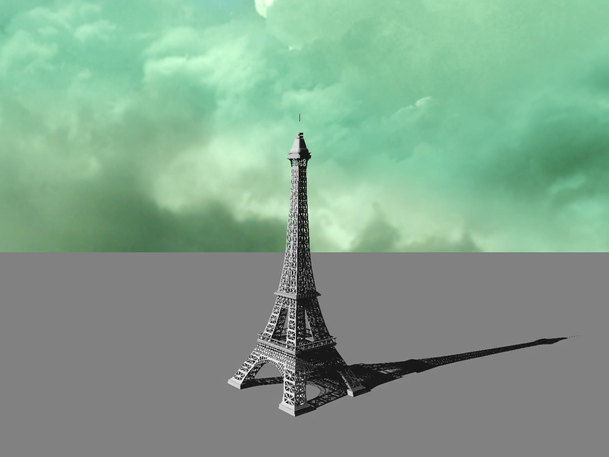
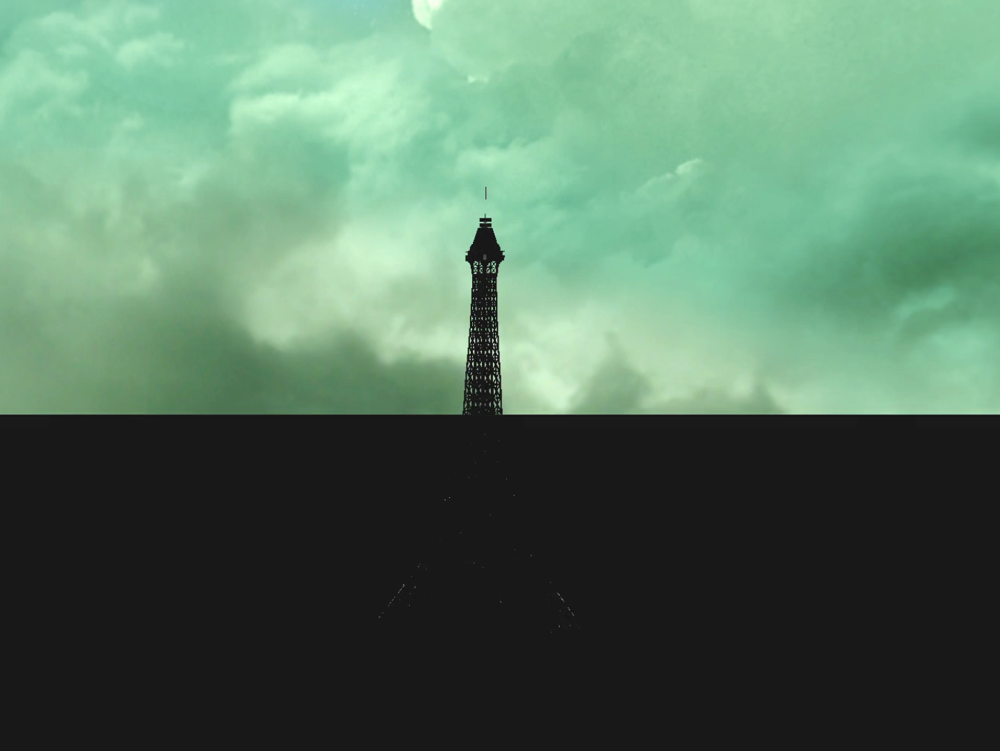
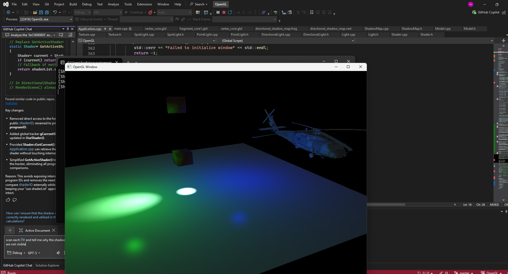
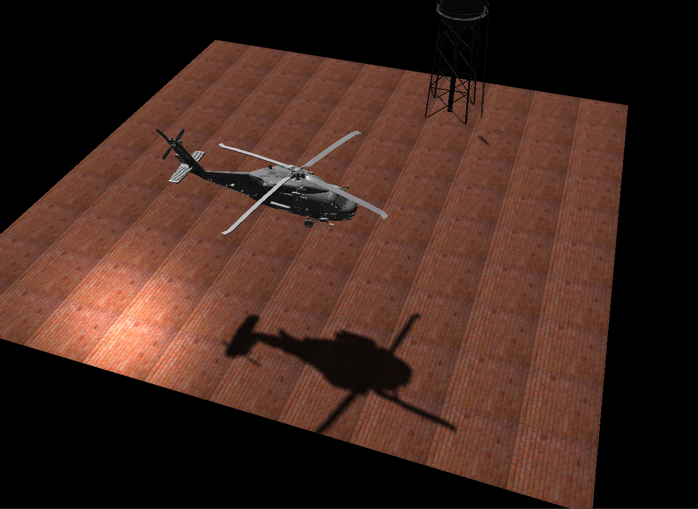
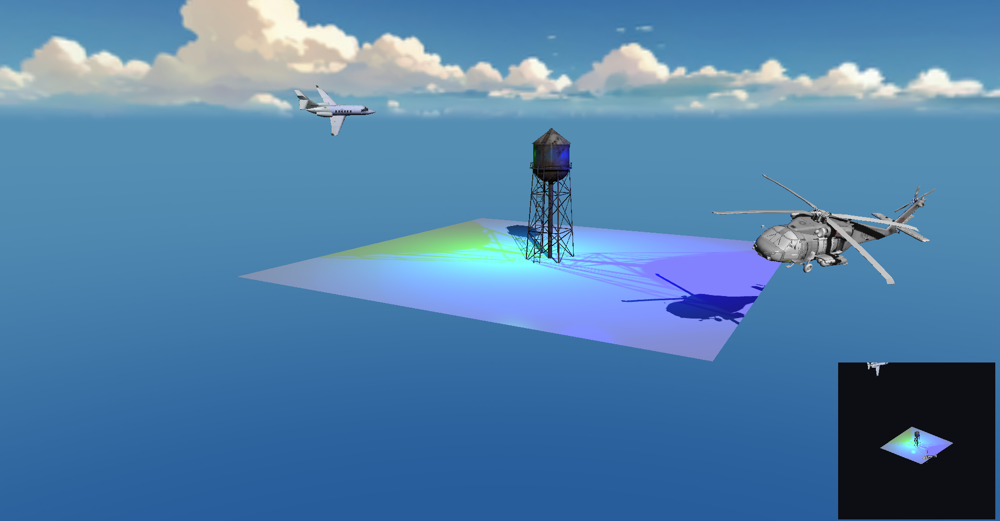
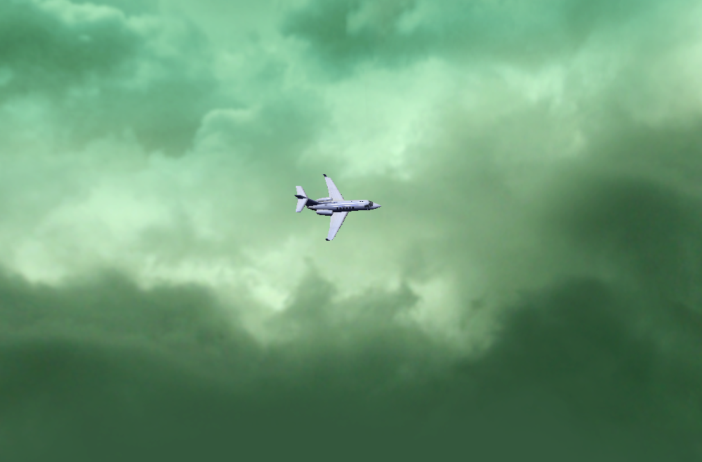
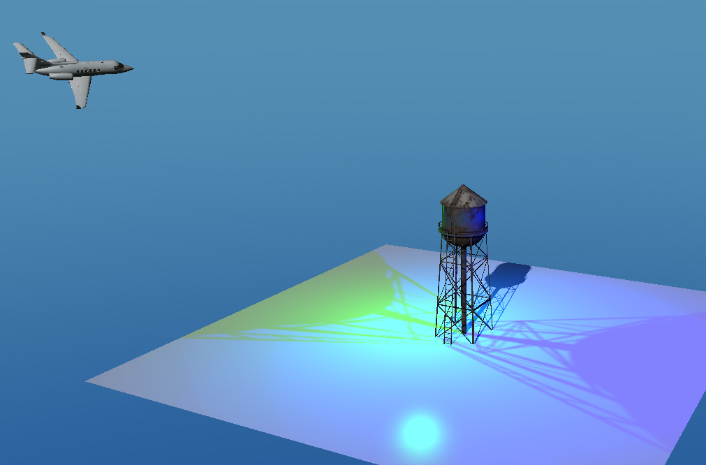

# 🚀 Learn-OpenGL — Custom C++ 3D Rendering Engine

A **custom real-time 3D rendering engine** built from scratch in **C++ using Modern OpenGL**.

Explore a small interactive 3D world featuring **dynamic lighting**, **real-time shadows**, a **day–night cycle**, **skybox rendering**, and **fully textured 3D models**.

---

# 🖼️ Screenshots

## 🌅 Day–Night Cycle

<p align="center">
  
  
</p>

---

## 💡 Lighting & Shadows

<p align="center">
  
  
</p>

---

## 🔍 Shadow Debug View

<p align="center">
  
</p>

---

## 🌌 Skybox Rendering

<p align="center">
  
  
</p>

---

# ✨ Features

## 🎮 Rendering

* Modern **OpenGL Core Profile**
* VAO, VBO, EBO abstraction
* Depth testing
* Wireframe debug mode

## 💡 Lighting System

* **Phong Lighting Model**

  * Ambient
  * Diffuse
  * Specular
* Light types:

  * Directional
  * Point
  * Spot (flashlight)

## 🌑 Shadow Mapping

* Directional shadow mapping
* Omni-directional shadows
* Real-time shadow rendering
* Debug light-space view

## 🌅 Environment

* Animated **Day–Night Cycle**
* Moving sun (directional light)
* Skybox using cubemaps

## 🎥 Camera System

* FPS-style movement
* Mouse look
* Zoom (FOV control)
* Camera switching

## 🧱 Models & Materials

* OBJ + MTL loading
* Textured meshes
* Material system (shininess, specular)


## 🎮 Input

* Keyboard + mouse handling
* Debug toggles

---

# 🎮 Controls

| Key               | Action            |
| ----------------- | ----------------- |
| **W A S D**       | Move camera       |
| **Space / Shift** | Up / Down         |
| **Mouse**         | Look around       |
| **Scroll**        | Zoom              |
| **Tab**           | Switch camera     |
| **L**             | Toggle flashlight |
| **T**             | Wireframe mode    |
| **V**             | Light debug view  |
| **Esc**           | Quit              |

---

# 🧰 Dependencies

* GLFW
* GLAD
* GLM
* stb_image

---

# 🚧 Getting Started

## Clone

```bash
git clone https://github.com/Shaurya1907/learn-OpenGL
cd learn-OpenGL
```

## Run

* Open in **Visual Studio 2022**
* Set startup project
* Build & Run

---

# 🧱 Project Structure

```
src/

main.cpp
Window.*
Shader.*
Mesh.*
Texture.*

DirectionalLight.*
PointLight.*
SpotLight.*

Material.*
Model.*
Skybox.*

io/
  keyboard.*
  mouse.*
  camera.*

Shaders/
Textures/
Models/
```

---

# 🔍 Technical Highlights

* Real-time shadow mapping
* Multiple light types
* Skybox rendering
* Model loading pipeline
* Camera system
* Day–night simulation

---

# 🎯 Future Improvements

* [ ] PBR Rendering
* [ ] HDR
* [ ] Post-processing
* [ ] Terrain
* [ ] ImGui UI
* [ ] Animations
* [ ] Deferred rendering

---

# 📜 License

This project is licensed under the **MIT License** — see the  
[Licence.txt](Licence.txt) file for details.

